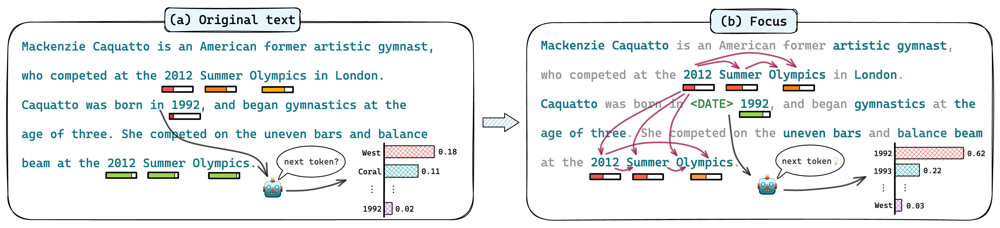

# Enhancing Uncertainty-Based Hallucination Detection with Stronger Focus (EMNLP 2023)
[](https://github.com/tatsu-lab/stanford_alpaca/blob/main/LICENSE) 
[](https://www.python.org/downloads/release/python-390/) 

This is the repo for our EMNLP 2023 main conference paper "**Enhancing Uncertainty-Based Hallucination Detection with Stronger Focus**"[[Arxiv]](https://arxiv.org/abs/2311.13230) [[Poster]](assets/FOCUS_POSTER.pdf) [[PPT]](assets/Enhancing%20Uncertainty-Based%20Hallucination%20Detection%20with%20Stronger%20Focus.pptx).

## Reproduction
Take the llama-30b-SFT version as an example, to reproduce our results on `wiki_bio_gpt3_hallucination` dataset, you can run
```bash
python run_wikibiogpt3.py --model_path ausboss/llama-30b-supercot --low_cpu_mem_usage
```
To reproduce our results on `XSumFaith` dataset, you can run
```bash
python run_xsum.py --model_path ausboss/llama-30b-supercot --low_cpu_mem_usage
```
To reproduce our results on `FRANK` dataset, you can run
```bash
python run_frank.py --model_path ausboss/llama-30b-supercot --low_cpu_mem_usage
```
## Inference
Here is an example of how to run the code on wikibio task with your own data using LLaMA(v1) family models, you can modify the source code (e.g. prompt) to fit your own scenario. 
```bash
python inference.py --model_path ausboss/llama-30b-supercot --task wikibio --only_keyword --use_penalty --add_type --use_idf --use_entropy --gamma 0.9 --rho 0.01
```
- `task`: currently only support `wikibio`.
- `only_keyword`: only consider keyword when calculating hallucination score.
- `use_penalty`: if use penalty transmission.
- `add_type`: if provide entity type information before named entity.
- `use_entropy`: if consider token entropy as part of hallucination score.
- `use_idf`: if consider token frequency.
- `model_path`: path to the proxy model or the model name in huggingface.
- `gamma`: the discount value when accumulating the penalty, default to 0.9.
- `rho`: the threshold of removing tokens with a lower probability, default to 0.01.

We provide several example inputs in `inference.py`, you can replace them with your own data.

For wikibio task you should provide:
```angular2html
concept: the wikipedia passage concept.
response: the model output to be evaluated.
```
The outputs are a list of sentence-level hallucination scores `[(sentence_id, score)]` and a passage-level hallucination score `float` normalized to [0,1].

When you run the command above, the following result is expected (using 4 NVIDIA A10 GPUs).
```angular2html
[(0, 0.24670052861789984), (1, 0.29810068306299564), (2, 0.2951899944143249), (3, 0.3141602069019362), (4, 0.30233789540108125)]
0.2904945467183812
[(0, 0.47496516642470016), (1, 0.6360287223580757), (2, 0.5964681300706745), (3, 0.6218195278510681), (4, 0.5845075986061048), (5, 0.6956721858189342), (6, 0.7153816822922959), (7, 0.8139274048758866)]
0.6488059482008401
```
## Data
###  Wiki_bio_gpt3_hallucination dataset
Since the original `wiki_bio_gpt3_hallucination` dataset does not provide the corresponding concept information for each passage, we searched for the corresponding row in the wikibio dataset based on the wiki_bio_test_idx and concatenated it into following prompt:
```python
f"This is a passage from Wikipedia about {concept}"
```
We have saved the results in data/wikibio_gpt3_v3.pkl.
### Token idf data
We provided a script `utils/count_token_frequency.py` to calculate the token idf for each token in the provided tokenizer. Take RedPajama as an example, you can run:
```bash
python count_token_frequency.py --tokenizer togethercomputer/RedPajama-INCITE-7B-Base
```
This will save the calculated token idf file in the `token_frequency_data` folder. We have provided some token idf files used in our experiments, which can be found in the `token_frequency_data` folder.
## Requirements
+ python = 3.8
+ pytorch >= 1.9.0
+ transformers >= 4.28.1
+ tokenizers >= 0.13.3
+ spacy >= 3.5.1
+ accelerate >= 0.18.0


***When running with llama-65b (float16), please ensure that at least 140 GiB GPU memory is available (more is needed for longer input sequence lengths).**
